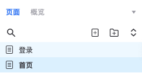
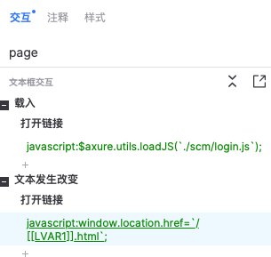

# Axure 原型项目

使用 Vue 打造的 Axure 后台原型

## 基础知识

- [TypeScript](https://www.typescriptlang.org/)
- [Vue 3](https://vuejs.org/)
- [Element Plus](https://element-plus.org/)
- [UnoCSS](https://unocss.dev/)
- [Dexie](https://dexie.org/)

## 使用方法

1、执行命令，生成页面对应的 iife 文件

```bash
entry=xxx bun run build
```

2、页面名称必须对应 routerPath 的值



3、在 Axure 中添加名称为 page 的 input 元件，并设置交互事件


